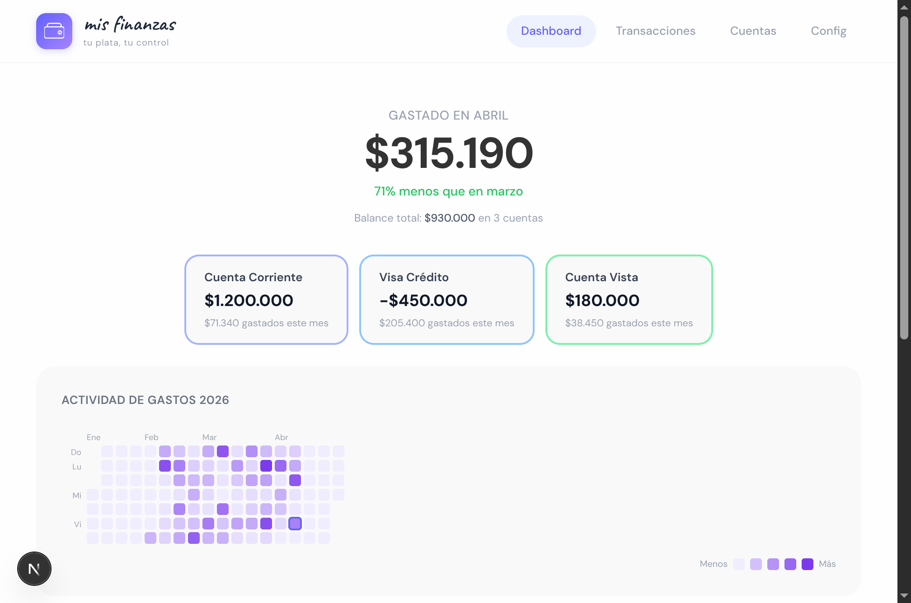
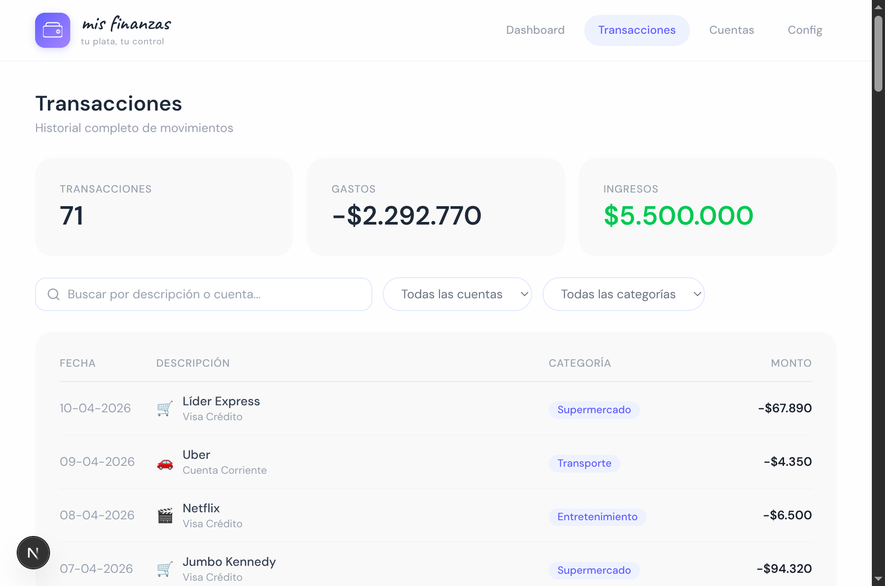
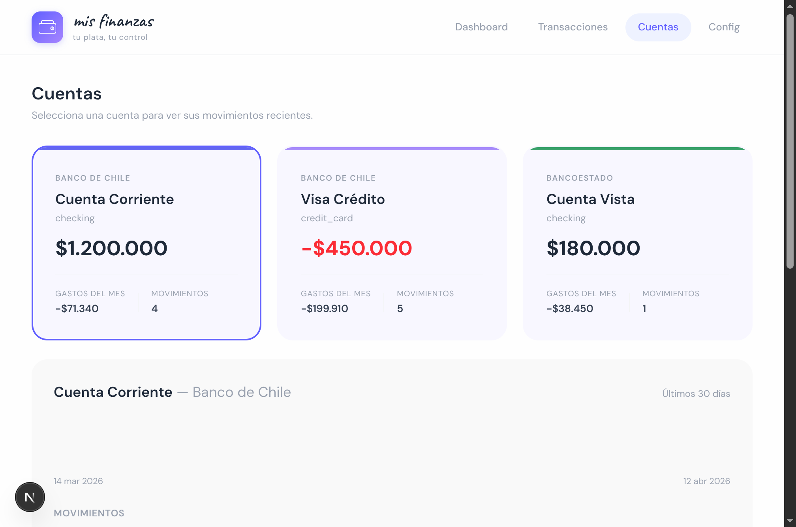
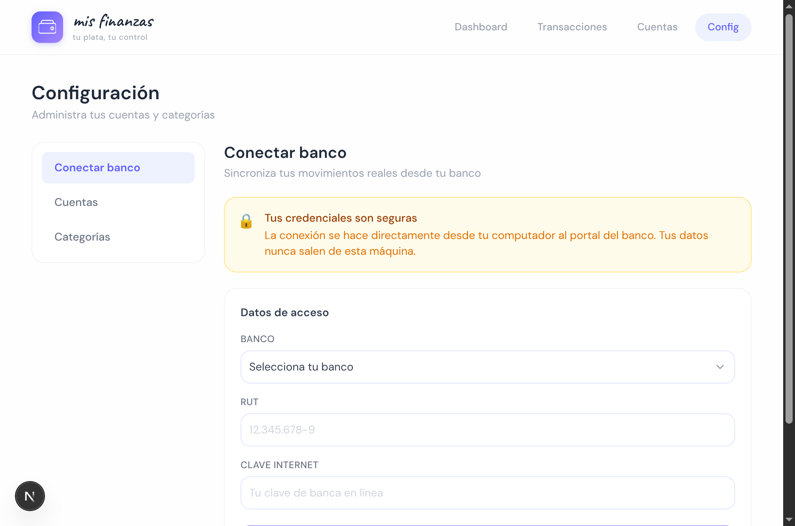

<p align="center">
  
</p>

<h1 align="center">mis finanzas</h1>
<p align="center"><em>tu plata, tu control</em></p>

<p align="center">
  App de finanzas personales que corre 100% local en tu computador.<br>
  Conecta tus bancos chilenos, ve tus gastos, y entiende en qué se te va la plata.
</p>

<p align="center">
  <a href="https://luma.com/u1azetih">
    
  </a>
</p>

<p align="center">
  <strong>Construida en vivo en ~60 minutos</strong> durante un livestream de <a href="https://aiplusfriends.com">ai+friends</a><br>
  por dos personas sin experiencia en programacion, usando solo IA como herramienta.
</p>

---

## La historia

Cada mes, Fernando miraba el estado de cuenta de su tarjeta de credito. Cada mes terminaba confundido. Las descripciones eran pesimas, habian tantas transacciones que se rendia y simplemente pagaba.

Un dia descubrio que un amigo tenia el mismo problema. Decidieron construir una solucion juntos -- en vivo, frente a una audiencia, sin saber programar.

El resultado es **mis finanzas**: una app que corre en tu computador, se conecta a tu banco real, y te muestra en que se te va la plata. Sin suscripciones, sin entregar tus datos a nadie.

**Todo el proceso quedo grabado en el [livestream de ai+friends](https://luma.com/u1azetih).**

## Screenshots

<p align="center">
  
</p>
<p align="center"><em>Dashboard: cuanto gastaste este mes, heatmap estilo GitHub, y desglose por categoria</em></p>

<p align="center">
  
</p>
<p align="center"><em>Transacciones: busqueda y filtros por cuenta y categoria</em></p>

<p align="center">
  
</p>
<p align="center"><em>Cuentas: vista detallada de cada cuenta con grafico de 30 dias</em></p>

<p align="center">
  
</p>
<p align="center"><em>Conectar banco: sincroniza tus movimientos reales desde BancoEstado, Banco de Chile, Santander, BCI, y mas</em></p>

## Que hace

- **Dashboard** con gasto del mes como protagonista, heatmap anual estilo GitHub, y donut de categorias
- **Transacciones** con busqueda en tiempo real y filtros por cuenta/categoria
- **Cuentas** con tarjetas seleccionables, grafico de 30 dias, y detalle de movimientos
- **Configuracion** para agregar cuentas, categorias, y conectar bancos reales
- **Conexion bancaria real** via [open-banking-chile](https://github.com/kaihv/open-banking-chile) (9 bancos soportados)
- **100% local** -- tus datos nunca salen de tu computador

## Bancos soportados

| Banco | Estado |
|-------|--------|
| BancoEstado (CuentaRUT) | Probado en vivo |
| Banco de Chile | Soportado |
| Santander | Soportado |
| BCI | Soportado (requiere BCI Pass) |
| Itau | Soportado (requiere Itau Key) |
| Banco Falabella / CMR | Soportado |
| Scotiabank | Soportado |
| BICE | Soportado |
| Banco Edwards | Soportado |

## Tech stack

- **Next.js 16** (App Router, Server Components, Server Actions)
- **Prisma + SQLite** (base de datos local, un solo archivo)
- **Tailwind CSS** (diseno Airy Pastel con paleta violeta)
- **open-banking-chile** (scraping de bancos chilenos)
- **TypeScript** de punta a punta

## Instalacion

```bash
# Clonar
git clone https://github.com/fernandosmither/finanzas-personales.git
cd finanzas-personales

# Instalar dependencias
npm install

# Configurar base de datos
cp .env.example .env
npx prisma migrate dev
npx tsx prisma/seed.ts  # datos de prueba (opcional)

# Correr
npm run dev
```

Abrir [http://localhost:3000](http://localhost:3000)

## Conectar tu banco

1. Ir a **Config > Conectar banco**
2. Seleccionar tu banco
3. Ingresar tu RUT y clave de banca en linea
4. Click en **Sincronizar movimientos**
5. Se abrira una ventana de Chrome por ~30 segundos mientras extrae los datos

> **Nota de seguridad**: La conexion se hace directamente desde tu computador al portal del banco. Tus credenciales nunca se envian a ningun servidor externo. Se pasan al proceso de scraping via stdin (no visibles en `ps`).

## Creditos

Construida en vivo por [Fernando Smith](https://github.com/fernandosmither) y [Nacho Bernardo](https://luma.com/u1azetih) durante un evento de [ai+friends](https://aiplusfriends.com) -- la comunidad latinoamericana para aprender IA construyendo.

La app fue disenada y programada integramente con **Claude Code (Opus 4.6)** en una sola sesion.

## Licencia

MIT
